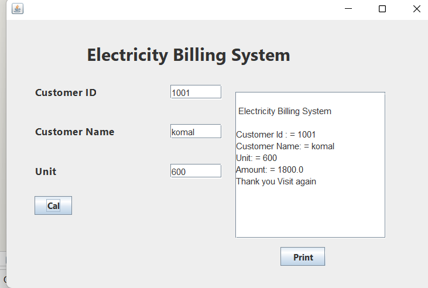
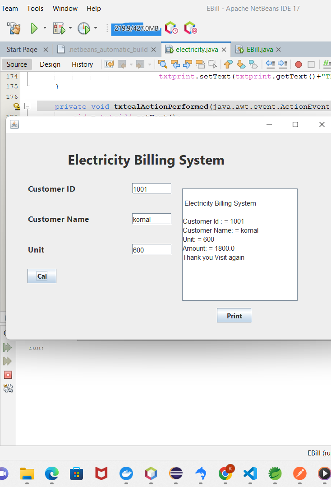
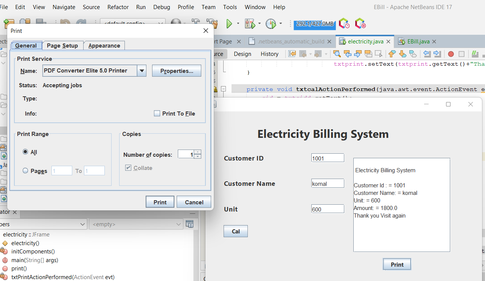
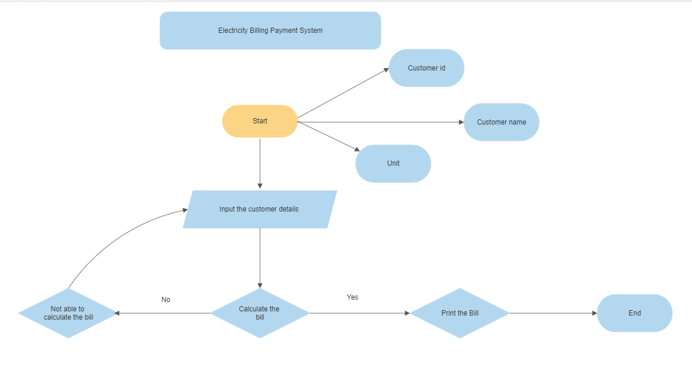

# ELECTRICITY BILLING PAYMENT SYSTEM
# Project Documentaion -

 

 Electricity billing payemnt system is to manage the details of electricity,bill,connections,store record ,customer.It manages all the information about electricity and customer electricity.

# Table of Contents
1. [Abstract](#Abstract)
2. [Introduction](#Introduction)
3. [Getting Started](#GettingStarted)
4. [Steps to Develop a EBPS using Java GUI](#Steps_to_Develop_a_EBPS_using_Java_GUI)>
5. [Electricty Billing System Usage](#Electricty_Billing_System_Usage)
6. [Deployment](#Deployment)
7. [Flowchart](#Flowchart)

   
8. [Contributing](#Contributing)
9. [Authors](#Authors)
10. [Acknowledgements](#Acknowledgements)

## Abstract
This paper deals with the design of Internet billing system, in which it is possible pay invoices electronically.The  motivation  behind  the  task  is  to  construct  an  application program to lessen the manual work for dealing with the measure of units devoured by the clients and producing the power charge as per the type of customer – individual or business. It shows the details about customer, units devoured by them and bill history. It empowers them cover their bill if not paid. The date of payment will be refreshed while covering the bill.
## Introduction
Electricity billing payment system is a system where users can get instant electricity bill and pay them online via credit card or ATM card .It is determines the bill of the consumed power per unit time.
It provides an environment to maintain the consumer details.
The system calculates the electricity bill for every user and updates the information into their account every month.This  system  is  made  to  keep  the  records  about  the  bills  of  the  clients.  The administrator  can  deal  with  every  one  of  the  records;  the  enlisted  customers  like  individual customers, business customers can just deal with their own records and they can't perceive any subtleties  of  different  customers.

## Getting Started
These instructions will get you a copy of the project up and running on your local machine for development and testing purposes. See deployment for notes on how to deploy the project on a live system.
##  Prerequisites
1. NetBeans Installation
2. Create a Project File in beans
4. Button Configuration
## Installing
## Netbeans Installation
NetBeans IDE is a Free open-Source, Cross-plate form Integrated Development Environment (IDE). It can run any machine which consists of the Java Virtual Machine (JVM). It consists of many features for application development as follows:-

Step 1: You need to have a setup file of the NetBeans JAVA into your setup.

step 2: You can download any type of setup as per your requirements.

Step 3. Right-click on the setup or you can Double-Click on the setup by using the mouse.

Step 4.Click on the next option

### Create a project File in Netbeans
Start the newbeans IDE

1.Click on File then new project after that java and then on java application.

File->new project->java->java application

2.After creating the project click on

Source package->new->Jframe

3.then select according to your project name and wizard.

4.click on the finish

-DRAG and DROP GUI'S-

In the Projects window, right-click the DragAndDropSample project,

## Electricty Billing System Usage

TEXT-FIELDS:-In this project there are three main text fields.First one is customer id in which we have to fill customer id.Second one is for customer name ,in this text field we have to fill customer name.And the third one is for unit in this we have to fill unit which is consumed by the customers.

BUTTONS:-In this project we have two buttons –first one is cal button which is calculate the gross amount of the unit which is consumed by the customers.and also using java code to calculate the total bill amount.Second one is for print button print all the details which was shown by the cal button like customer id,customer name,unit and amount etc.

## Deployment

## Flowchart
 

 [MongoDB ](#example)-Database

 [Express ](#example)-Server Framework

 [VueJs ](#example)- Web Framework

 [NodeJs](#example)-Server Environment

## Authors

- [@Komalsaini](https://github.com/KomalSaini16)-Learner

## Acknowledgements

 #### I would like to express my deepest gratitude to every coder.

#### References -Tutus Funny.

